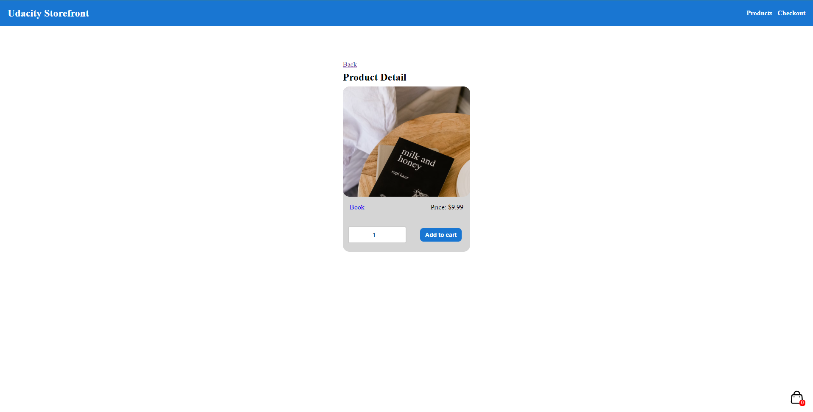

# Udacity Storefont

This project was generated with [Angular CLI](https://github.com/angular/angular-cli) version 16.0.0.
## Project Summary 
E-commerce website – an application that allows users to view a list of available products to purchase, add them to a shopping cart, and ultimately complete the checkout process.

### List of product

### Product detail

### Checkout page

### My cart

## Installation Instructions

To install dependencies run command from CLI `npm install`

### Project Dependencies
- [Angular](https://angular.io/)
- [ngx-mask](https://www.npmjs.com/package/ngx-mask): NGX MASK is the best directive to solve masking input with needed pattern
- [ngx-toastr](https://www.npmjs.com/package/ngx-toastr): Toast Component

## Development server

Run `ng serve` for a dev server. 

Navigate to `http://localhost:4200/`. The application will automatically reload if you change any of the source files.

## Resource

- [Image](https://unsplash.com/)
- [Icon](https://www.svgrepo.com/)
